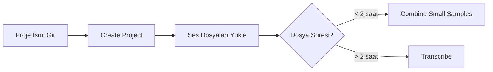

# 🎙️ Dataset Maker Kurulum Rehberi

<div align="center">


**Ses veri setleri oluşturmak için kapsamlı kurulum ve kullanım kılavuzu**

[Özellikler](#-özellikler) • [Kurulum](#-kurulum) • [Kullanım](#-kullanım) • [Sorun Giderme](#-sorun-giderme)

</div>

---

## 📋 İçindekiler

- [Genel Bakış](#-genel-bakış)
- [Özellikler](#-özellikler)
- [Sistem Gereksinimleri](#-sistem-gereksinimleri)
- [Kurulum](#-kurulum)
  - [1. Ön Hazırlıklar](#1-ön-hazırlıklar)
  - [2. Proje Kurulumu](#2-proje-kurulumu)
  - [3. Model Yapılandırması](#3-model-yapılandırması)
- [Kullanım](#-kullanım)
- [Yapılandırma](#-yapılandırma)
- [Sorun Giderme](#-sorun-giderme)
- [Katkıda Bulunma](#-katkıda-bulunma)

---

## 🌟 Genel Bakış

Bu proje, ses dosyalarından yüksek kaliteli veri setleri oluşturmak için geliştirilmiş bir araçtır. **Emilia Pipeline** kullanarak ses dosyalarını işler, transkript oluşturur ve TTS (Text-to-Speech) modelleri için optimize edilmiş veri setleri üretir.

### 🎯 Ne Yapar?

- 🎵 Uzun ses dosyalarını otomatik olarak segmentlere ayırır
- 📝 Whisper AI ile otomatik transkripsiyon
- 🔊 UVR ile arka plan gürültüsü temizleme
- 📊 Ses kalitesi filtreleme (DNSMOS)
- 🗣️ Konuşmacı ayrıştırma (Speaker Diarization)
- 📦 IndexTTS2 için hazır veri seti çıktısı

---

## ✨ Özellikler

| Özellik | Açıklama |
|---------|----------|
| 🤖 **AI Destekli Transkripsiyon** | Whisper large-v3 modeli ile yüksek doğrulukta transkript |
| 🎚️ **Ses İyileştirme** | UVR-MDX-NET ile profesyonel ses ayrıştırma |
| ⚡ **GPU Hızlandırma** | CUDA 12.8 ile optimize edilmiş işleme |
| 🌐 **Web Arayüzü** | Gradio tabanlı kullanıcı dostu arayüz |
| 🔧 **Esnek Yapılandırma** | JSON tabanlı özelleştirilebilir ayarlar |
| 📈 **Kalite Kontrolü** | Otomatik ses kalitesi değerlendirmesi |

---

## 💻 Sistem Gereksinimleri

### Donanım
- **GPU**: NVIDIA GPU (CUDA destekli)
- **RAM**: En az 16 GB (32 GB önerilir)
- **Depolama**: En az 50 GB boş alan

### Yazılım
- **İşletim Sistemi**: Windows 10/11
- **Python**: 3.8 veya üzeri
- **CUDA Toolkit**: 12.8
- **PowerShell**: Admin yetkisi

---

## 🚀 Kurulum

### 1. Ön Hazırlıklar

#### 📦 Git Kurulumu

```powershell
# Git'i indirin ve kurun
# İndirme linki: https://git-scm.com/install/windows
```

> 💡 **İpucu**: Kurulum sırasında "Git Bash" ve "Git from the command line" seçeneklerini işaretleyin.

#### 🔧 UV Paket Yöneticisi

PowerShell'i **yönetici olarak** açın ve aşağıdaki komutu çalıştırın:

```powershell
powershell -ExecutionPolicy ByPass -c "irm https://astral.sh/uv/install.ps1 | iex"
```

#### 🎮 CUDA Toolkit 12.8

1. [CUDA 12.8 indirme sayfasına](https://developer.nvidia.com/cuda-12-8-0-download-archive?target_os=Windows&target_arch=x86_64&target_version=11) gidin
2. `.exe` dosyasını indirin
3. Kurulum sihirbazını takip edin

> ⚠️ **Önemli**: Kurulum sonrası sistemi yeniden başlatın.

#### 🎬 FFmpeg Kurulumu

FFmpeg'i indirin ve Windows PATH'e ekleyin:

```powershell
# FFmpeg'i PATH'e eklemek için sistem ortam değişkenlerini düzenleyin
```

---

### 2. Proje Kurulumu

#### 📥 Projeyi Klonlama

```powershell
git clone https://github.com/JarodMica/dataset-maker
cd dataset-maker
```

#### 📦 Bağımlılıkları Yükleme

```powershell
# Bağımlılıkları senkronize edin
uv sync

# Optimum paketini yeniden yükleyin (sorun giderme)
uv remove optimum[onnxruntime-gpu]
uv add optimum[onnxruntime-gpu]
```

---

### 3. Model Yapılandırması

#### 🤖 UVR Model İndirme

1. [Hugging Face model sayfasına](https://huggingface.co/Jmica/dataset_maker/blob/main/UVR-MDX-NET-Inst_HQ_3.onnx) gidin
2. `UVR-MDX-NET-Inst_HQ_3.onnx` dosyasını indirin
3. Dosyayı `dataset-maker/emilia_models/` klasörüne yerleştirin

```
dataset-maker/
└── emilia_models/
    └── UVR-MDX-NET-Inst_HQ_3.onnx
```

#### 🔑 Hugging Face Token Oluşturma

1. [Pyannote Speaker Diarization](https://huggingface.co/pyannote/speaker-diarization-community-1) sayfasına gidin
2. **Grant Access** butonuna tıklayın
3. [Tokens sayfasından](https://huggingface.co/settings/tokens) **Read** yetkili yeni token oluşturun
4. Token'ı kopyalayın

#### ⚙️ Yapılandırma Dosyası

`dataset-maker/Emilia/config.example.json` dosyasını açın ve düzenleyin:

```json
{
    "huggingface_token": "YOUR_TOKEN_HERE",
    "filters": {
        "min_duration": 1.5,
        "max_duration": 30,
        "min_dnsmos": 0.5,
        "min_char_count": 1
    }
}
```

Dosyayı `config.json` olarak kaydedin:

```powershell
# Dosyayı yeniden adlandırın
mv Emilia/config.example.json Emilia/config.json
```

---

## 🎯 Kullanım

### 1. Uygulamayı Başlatma

```powershell
uv run gradio_interface.py
```

Tarayıcınızda `http://127.0.0.1:7860` adresine gidin.

---

### 2. Proje Oluşturma

<div align="center">



</div>

1. **New project name** alanına proje adını yazın
2. **Create Project** butonuna tıklayın
3. Ses dosyalarınızı yükleyin

> 📌 **Not**: Ses dosyaları en az 2 saat uzunluğunda olmalıdır.

---

### 3. Küçük Dosyaları Birleştirme

Eğer ses dosyalarınız 2 saatten kısa ise:

1. **Project Tasks** sekmesine gidin
2. **Combine Small Samples** bölümünü bulun
3. Dosyaları birleştirin

---

### 4. Transkripsiyon Ayarları

**Transcribe** sekmesine geçin ve aşağıdaki ayarları yapın:

| Parametre | Değer | Açıklama |
|-----------|-------|----------|
| **Language** | `tr` | Türkçe dil desteği |
| **Slicing Method** | `Emilia Pipe` | Emilia pipeline kullan |
| **Emilia Batch Size** | `16` | Batch işleme boyutu |
| **Emilia Whisper Model** | `large-v3` | En yüksek doğruluk |
| **Emilia Whisper Threads** | `8` | CPU thread sayısı |
| **Min Segment Duration** | `0.25` | Minimum segment süresi (saniye) |

#### 🎛️ Ek Seçenekler

- ✅ **Run UVR Separation**: Arka plan gürültüsü varsa işaretleyin
- ✅ **Use File Hash Naming**: Dosya hash isimlendirme
- ✅ **Verbose**: Detaylı log çıktısı

---

### 5. Transkripsiyon Başlatma

**Start new transcription** butonuna tıklayın ve işlemin tamamlanmasını bekleyin.

---

### 6. Çıktı

İşlem tamamlandığında veri setiniz şu konumda oluşturulur:

```
dataset-maker/
└── datasets_folder/
    └── [proje_adı]/
        └── [proje_adı]_emilia_dataset/
```

Bu klasör **IndexTTS2** için hazır formattadır! 🎉

---

## ⚙️ Yapılandırma

### Filtre Parametreleri

`config.json` dosyasındaki filtre ayarlarını ihtiyacınıza göre özelleştirebilirsiniz:

```json
{
    "filters": {
        "min_duration": 1.5,      // Minimum segment süresi (saniye)
        "max_duration": 30,       // Maximum segment süresi (saniye)
        "min_dnsmos": 0.5,        // Minimum ses kalitesi skoru (0-1)
        "min_char_count": 1       // Minimum karakter sayısı
    }
}
```

### Performans Optimizasyonu

| Parametre | Düşük Bellek | Dengeli | Yüksek Performans |
|-----------|--------------|---------|-------------------|
| Batch Size | 4 | 8 | 16-32 |
| Threads | 4 | 8 | 16 |
| Model | base | medium | large-v3 |

---

## 🔧 Sorun Giderme

### ❌ CUDA Hatası

```
Error: CUDA not available
```

**Çözüm**:
1. NVIDIA sürücülerinin güncel olduğundan emin olun
2. CUDA Toolkit'in doğru kurulduğunu kontrol edin
3. Sistemi yeniden başlatın

---

### ❌ Optimum Paketi Hatası

```
Error: optimum[onnxruntime-gpu] not found
```

**Çözüm**:
```powershell
uv remove optimum[onnxruntime-gpu]
uv add optimum[onnxruntime-gpu]
```

---

### ❌ Hugging Face Token Hatası

```
Error: Invalid token
```

**Çözüm**:
1. Token'ın doğru kopyalandığından emin olun
2. Token'ın **Read** yetkisine sahip olduğunu kontrol edin
3. Pyannote modellerine erişim izni aldığınızdan emin olun

---

### ❌ FFmpeg Bulunamadı

```
Error: FFmpeg not found
```

**Çözüm**:
```powershell
# FFmpeg PATH'e eklenmiş mi kontrol edin
ffmpeg -version
```

---

## 📊 Proje Yapısı

```
dataset-maker/
├── 📁 emilia_models/          # AI modelleri
│   └── UVR-MDX-NET-Inst_HQ_3.onnx
├── 📁 Emilia/                 # Yapılandırma
│   └── config.json
├── 📁 datasets_folder/        # Çıktı veri setleri
├── 📄 gradio_interface.py     # Web arayüzü
└── 📄 README.md               # Bu dosya
```

---

## 🤝 Katkıda Bulunma

Katkılarınızı bekliyoruz! Lütfen şu adımları izleyin:

1. 🍴 Projeyi fork edin
2. 🌿 Feature branch oluşturun (`git checkout -b feature/amazing-feature`)
3. 💾 Değişikliklerinizi commit edin (`git commit -m 'Add amazing feature'`)
4. 📤 Branch'inizi push edin (`git push origin feature/amazing-feature`)
5. 🔃 Pull Request oluşturun

---

## 📝 Lisans

Bu proje MIT lisansı altında lisanslanmıştır.

---

## 🙏 Teşekkürler

- [JarodMica](https://github.com/JarodMica) - Dataset Maker
- [OpenAI](https://openai.com/) - Whisper Model
- [Hugging Face](https://huggingface.co/) - Model Hosting
- [Pyannote](https://github.com/pyannote) - Speaker Diarization

---

<div align="center">

**⭐ Projeyi beğendiyseniz yıldız vermeyi unutmayın! ⭐**

Made with ❤️ for the AI Community

[⬆ Başa Dön](#-dataset-maker-kurulum-rehberi)

</div>
